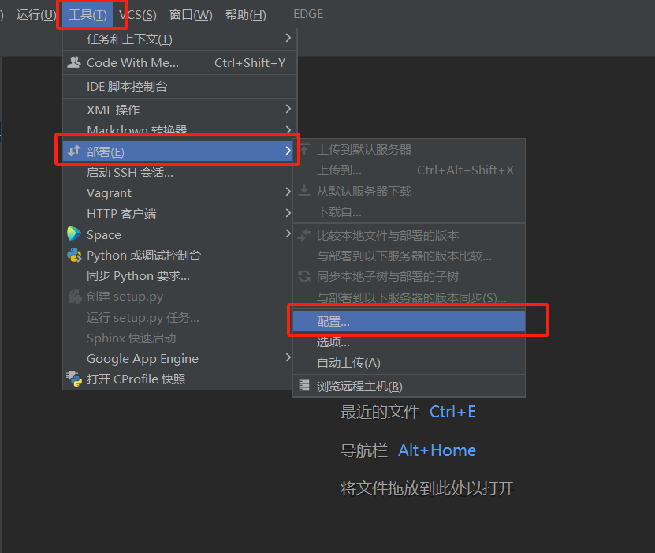
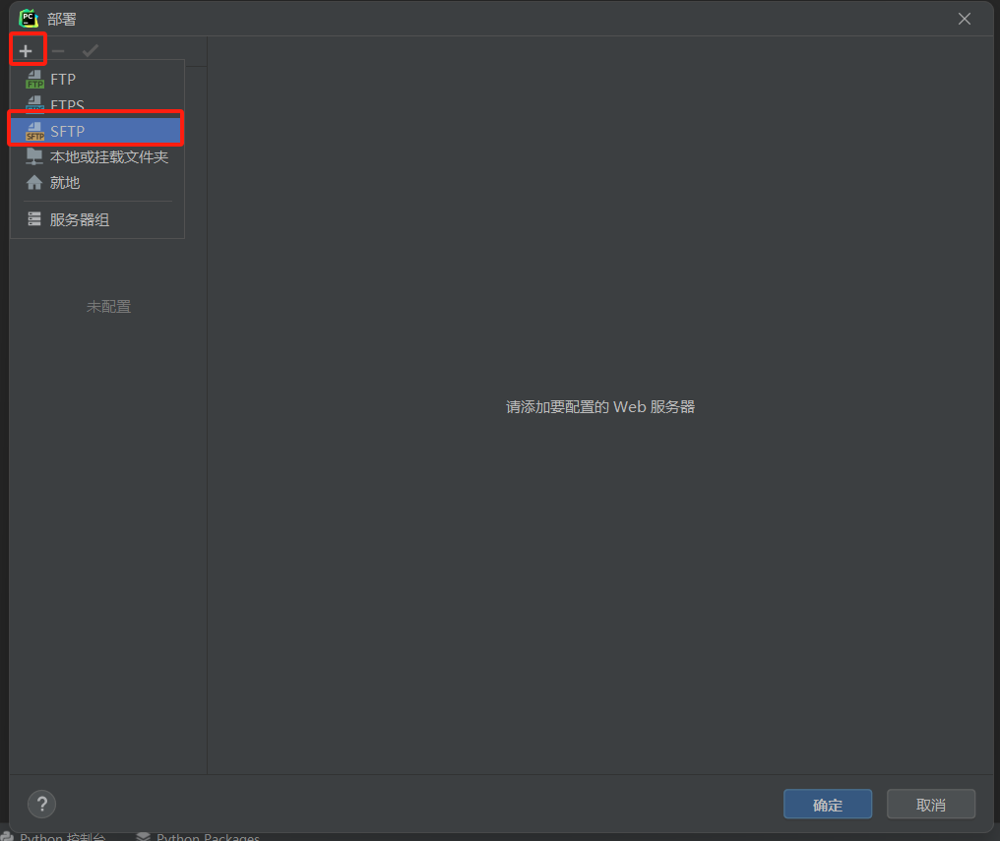
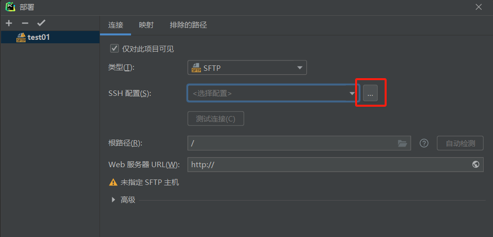
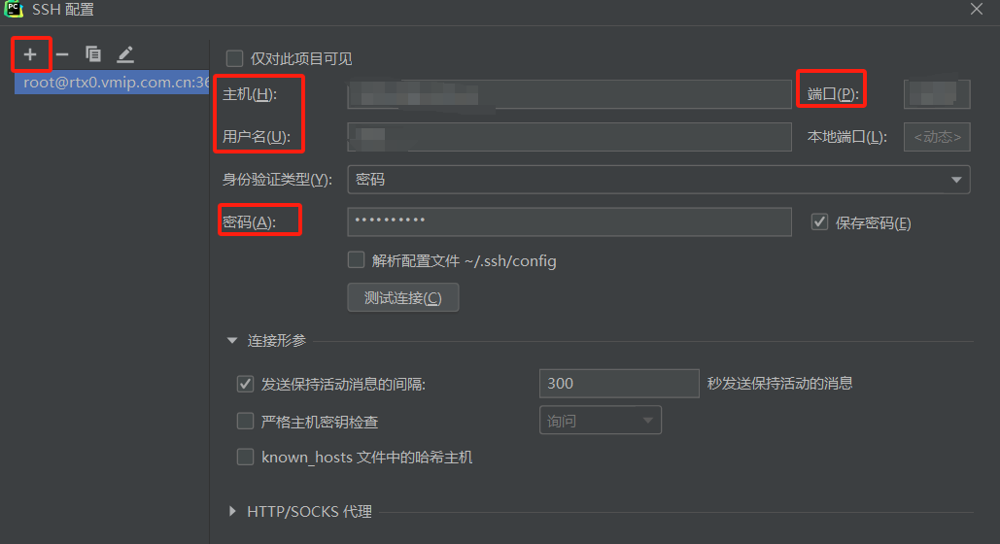
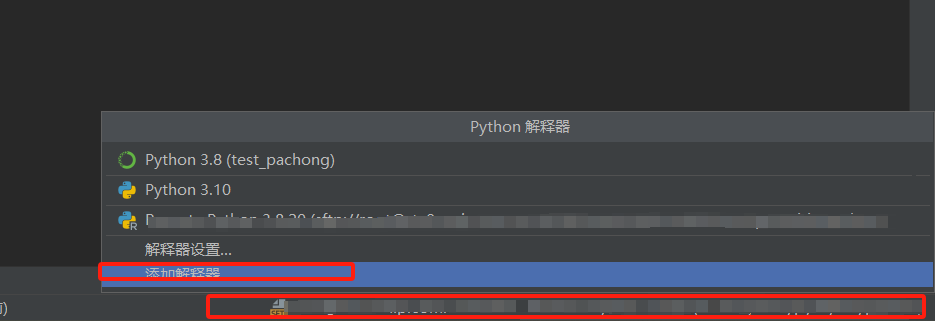
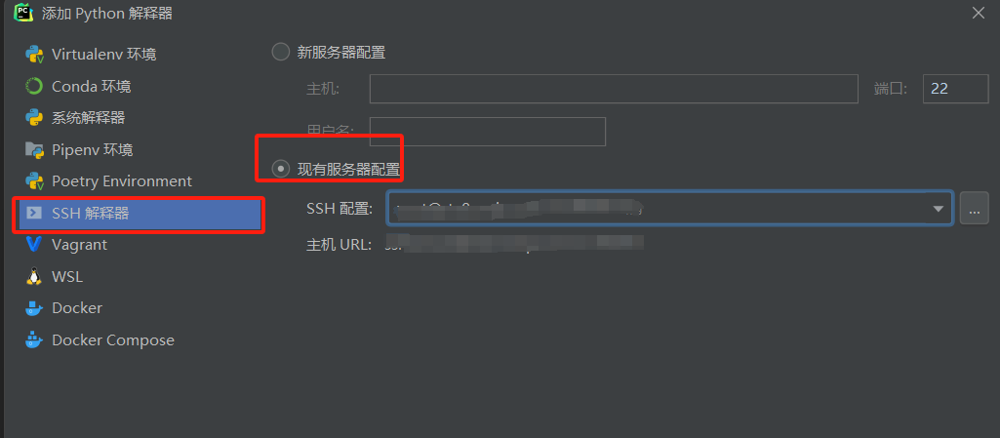
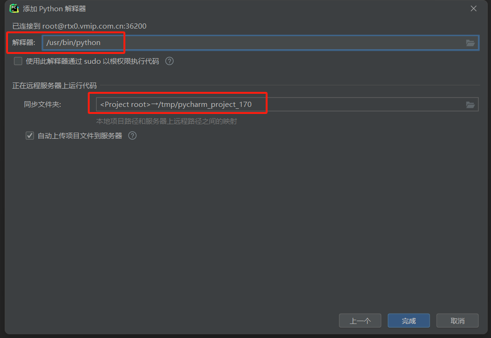

# Pycharm实现远程连接服务器

## ⭐前置工作

### 1.Pycharm专业版  
  获取方式以下二选一：   
  - [学生认证](https://blog.csdn.net/Colorkiller86/article/details/135457683)  
  - [破解版](https://www.bilibili.com/video/BV1Z44y1K7k6/?vd_source=259f52b0dd835932773d4385905c6c25)
  
### 2.服务器账号  

### 3.下载好的Github项目文件  

### 4.传输文件Xshell和SFTP  
  - [下载和使用](https://blog.csdn.net/qq_44614026/article/details/108896217)  

##  ⭐SSH连接

  1.随便打开一个项目，依次点击左上角的**工具**→**部署**→**配置**    
  
    
  
  2.选择右上角的 **+** ，选择 **SFTP** ，起一个服务器名称  

  

  3.进行SSH服务器配置  

    

  4.点击 **+** 添加SSH配置，根据所给账号和密码填写，主机、用户、端口和密码。以`root@xxx.com.cn`为例，主机为@之后的xxx.com.cn,用户为root,密码和端口根据所给信息填写,之后点击确定完成配置

    

  5.**在服务器终端完成Python环境配置后**，在Pycharm界面右下角选择项目解释器，点击添加Python解释器

    

  6.点击SSH解释器，使用刚刚配置好的服务器设置，点击确定

  

  7.解释器使用配置好的虚拟环境 `root/miniconda3/envs/py38/bin/python` (根据所安装conda位置进行选择，py38修改为虚拟环境名称即可)  

    

  
  
